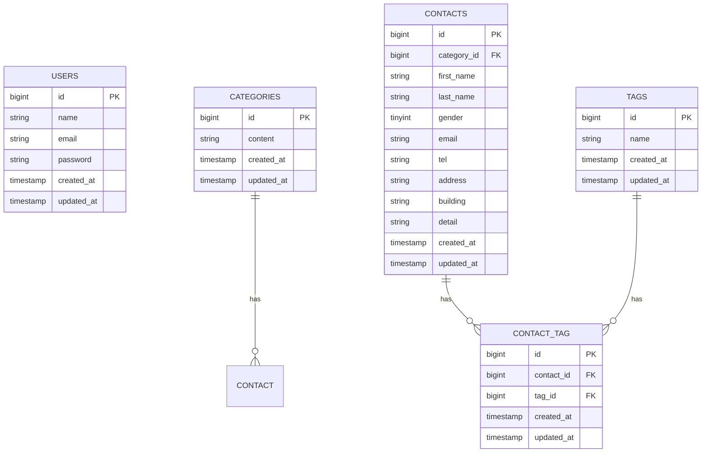

# プロジェクト名

COACHTECH お問い合わせフォーム（確認テスト）

## 概要

本プロジェクトは、COACHTECHの確認テストとしてLaravelを用いて実装した、お問い合わせ管理システムです。
ユーザーからのお問い合わせを登録し、管理者が一覧・検索・削除などの管理を行えるWebアプリケーションです。

主な機能：

- お問い合わせフォーム
- 入力内容確認画面
- お問い合わせ登録
- 管理者ログイン
- お問い合わせ一覧表示
- お問い合わせ検索
- タグ管理
- CSV出力

## ER図(mermaid記法)



## 環境構築手順

### 1. リポジトリをクローン

```bash

```

### 2. ディレクトリへ移動

```bash
cd
```

### 3. .env作成

```bash
cp .env.example .env
```

### 4. Docker起動

```bash
./vendor/bin/sail up -d
```

### 5. Composerインストール

```bash
composer install
```

### 6. APP_KEY生成

```bash
./vendor/bin/sail artisan key:generate
```

### 7. マイグレーション

```bash
./vendor/bin/sail artisan migrate
```

### 8. Seeder実行

```bash
./vendor/bin/sail artisan db:seed
```

### 9. ブラウザでアクセス

```
http://localhost
```

## 使用技術

- PHP
- Laravel
- MySQL
- Docker
- Laravel Sail
- Blade
- Tailwind CSS

## APIエンドポイント一覧

| メソッド | パス                         | 概要                 |
| -------- | ---------------------------- | -------------------- |
| GET      | '/api/v1/contacts'           | お問い合わせ一覧     |
| GET      | '/api/v1/contacts/{contact}' | お問い合わせ詳細     |
| POST     | '/api/v1/contacts'           | お問い合わせ新規作成 |
| PUT      | '/api/v1/contacts/{contact}' | お問い合わせ更新     |
| DELETE   | '/api/v1/contacts/{contact}  | お問い合わせ削除     |

## 開発環境URL

ユーザーお問い合わせフォーム：
http://localhost

管理者画面：
http://localhost/admin

## 作成者

- 氏名：安藤龍一
- GitHub：
- メール：anichi8120@gmail.com

```

```
